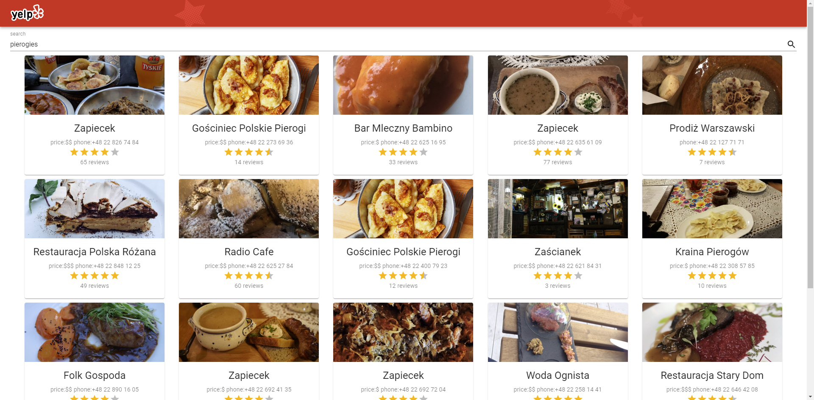
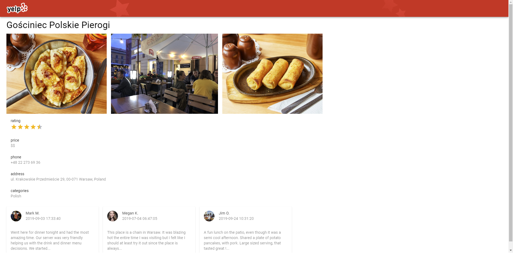
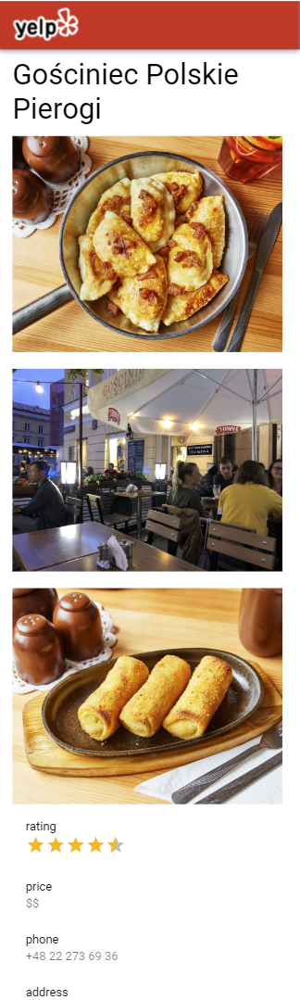

## worklog

- [create-react-app](docs/CRA-README.md)
- typescript
- prettier
- backend -> darklang [proxy](docs/proxy-in-dark.png) (https://darklang.com/)
  

- [search page](https://cz35iek.github.io/yelp-itc/#/)
  
  

- [details page](https://cz35iek.github.io/yelp-itc/#/business/5H9FELa0l_zjRb9lhcvyng) including description + reviews
  
  

- react-router
- material-ui (refactoring from ant.design)
- axios
- mobx
- [error handling](https://cz35iek.github.io/yelp-itc/#/business/wrong-id) amd validation (toast)

- styling (added styled components)
- publish app on github pages

`npm run deploy`

## todo

- tests (more)
- theme support
- geolocation
- maps

## scoring

- Search & Cards - 15 points
- Reviews - 10 points
- Http Interaction, Error Handling - 10 points
- Tests - 10 points
- Material Design - 5 points
